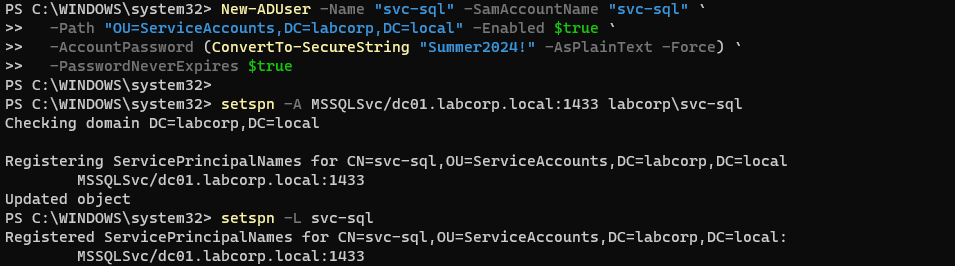
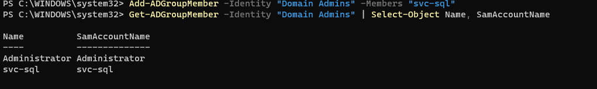
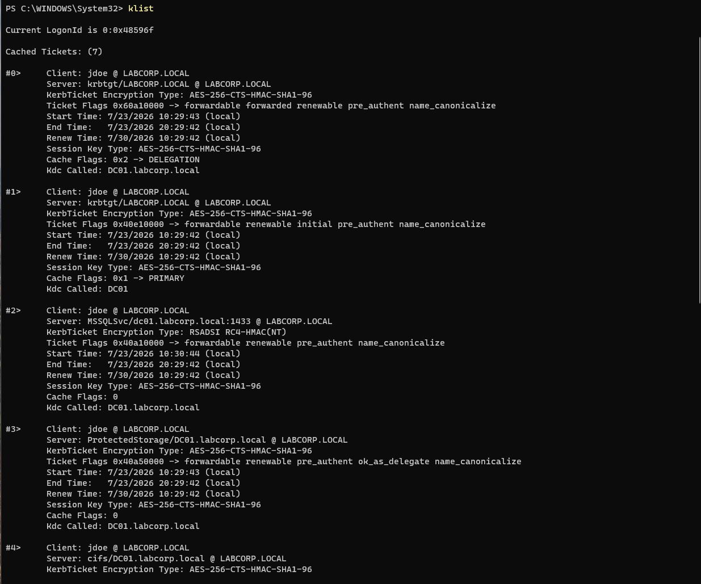
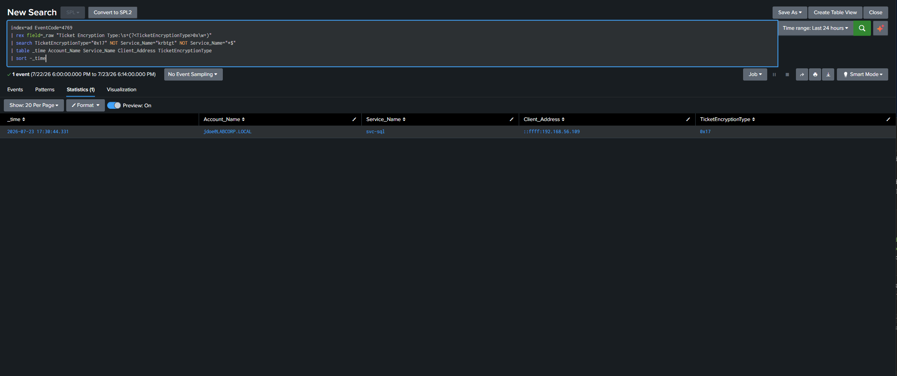
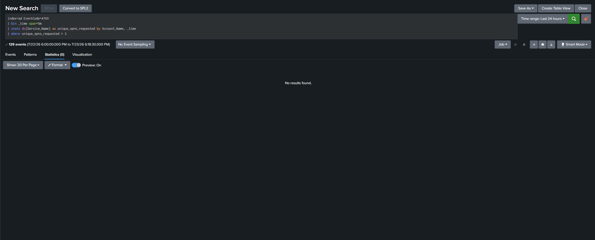
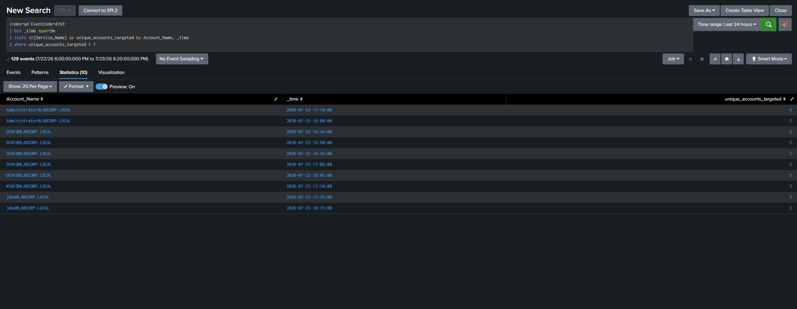
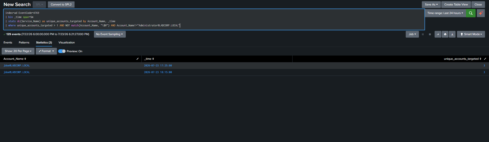

# Incident Report: Kerberoasting Attack Simulation & Detection

| Field | Value |
|---|---|
| **Report ID** | AD-IAM-LAB-2026-001 |
| **Analyst** | Brandon White |
| **Environment** | Home AD/IAM Lab — Windows Server 2025 (DC01), Windows 11 Pro (WS01), Splunk Enterprise |
| **Date of Activity** | July 23, 2026 |
| **Severity** | High (simulated / lab environment) |
| **Status** | Detected — Closed (planned exercise) |
| **MITRE ATT&CK** | T1558.003 — Steal or Forge Kerberos Tickets: Kerberoasting |

This report is split into two parts, reflecting the two disciplines the exercise
was designed to combine: **Part A** covers the attack simulation and SOC-side
detection engineering; **Part B** covers the root cause and IAM remediation,
since Kerberoasting only succeeds because of an underlying access-management
mistake, not a software vulnerability.

---

## Part A — Detection (SOC Angle)

### A.1 Executive Summary

This exercise built a small two-tier Active Directory domain (`labcorp.local`)
consisting of a Windows Server 2025 domain controller (`DC01`) and a
domain-joined Windows 11 Pro workstation (`WS01`), then simulated a
Kerberoasting attack from the perspective of a low-privileged, authenticated
domain user. A vulnerable service account (`svc-sql`) was deliberately
configured with a registered Service Principal Name (SPN), a weak
non-rotating password, and — to model a worst-case real-world finding —
membership in Domain Admins.

From `WS01`, logged in as the standard domain user `jdoe`, a Kerberos service
ticket was requested for `svc-sql` using nothing more than a native .NET API
call available to any authenticated user. No elevated privileges, exploit, or
third-party tooling were required. The resulting ticket was returned encrypted
with **RC4-HMAC**, the classic Kerberoasting indicator, and was captured via
Windows Event ID 4769 on the domain controller, forwarded to Splunk, and
detected using two complementary SPL queries.

### A.2 Environment & Architecture

| Component | Details |
|---|---|
| Domain Controller | `DC01` — Windows Server 2025 Standard (Desktop Experience), AD DS + DNS |
| Domain | `labcorp.local` (NetBIOS: `LABCORP`) |
| Workstation | `WS01` — Windows 11 Pro, domain-joined |
| Splunk Indexer | Existing home-lab Splunk Enterprise instance (from `splunk-siem-lab`) |
| Forwarder | Splunk Universal Forwarder installed on `DC01`, forwarding the Security event log |
| Network | VirtualBox host-only network, `192.168.56.0/24` |

**OU structure:**

```
labcorp.local
├── IT               (jdoe, mchen)
├── Finance          (asmith)
└── ServiceAccounts  (svc-sql)
```

### A.3 The Vulnerable Account

`svc-sql` was created to model a realistic, commonly-seen misconfiguration:
a service account set up once for a legacy application (implied by its SPN,
`MSSQLSvc/dc01.labcorp.local:1433`) and never revisited.

| Property | Value | Why it matters |
|---|---|---|
| Password | `Summer2024!` | Weak, dictionary-crackable |
| Password expiration | Never expires | No forced rotation |
| Registered SPN | `MSSQLSvc/dc01.labcorp.local:1433` | Makes the account roastable — any authenticated user can request a ticket for it |
| `msDS-SupportedEncryptionTypes` | `0x0` (not explicitly configured) | Account was never set to support AES, so the KDC fell back to RC4 |
| Group membership | **Domain Admins** | Worst-case privilege scenario — a compromised credential here is a full domain compromise, not a limited-scope one |


*Figure 1 — `setspn -L svc-sql` confirming the registered SPN.*


*Figure 2 — `Get-ADGroupMember` confirming `svc-sql` is a member of Domain Admins.*

The `msDS-SupportedEncryptionTypes: 0x0` finding is worth calling out
specifically: this wasn't an encryption downgrade forced during the attack —
the account was simply never configured to support AES in the first place,
which is itself a common, independent misconfiguration in real environments
and a second, distinct remediation item from the weak password.

### A.4 Attack Simulation

Performed from `WS01`, logged in as the standard domain user `jdoe`
(non-elevated, no local admin rights):

```powershell
Add-Type -AssemblyName System.IdentityModel
New-Object System.IdentityModel.Tokens.KerberosRequestorSecurityToken `
    -ArgumentList "MSSQLSvc/dc01.labcorp.local:1433"
```

This is legitimate, unprivileged Kerberos client behavior — any domain user
can request a service ticket for any registered SPN, which is precisely what
makes Kerberoasting difficult to distinguish from normal traffic without
targeted detection logic.

`klist` confirmed the ticket was issued and cached:

```
#2>  Client: jdoe @ LABCORP.LOCAL
     Server: MSSQLSvc/dc01.labcorp.local:1433 @ LABCORP.LOCAL
     KerbTicket Encryption Type: RSADSI RC4-HMAC(NT)
```


*Figure 3 — `klist` output on WS01: the `MSSQLSvc` ticket is RC4-HMAC while every other cached ticket (krbtgt, cifs, LDAP) is AES-256.*

Every other ticket in the same cache (`krbtgt`, `cifs/DC01`,
`LDAP/DC01.labcorp.local`) was issued as **AES-256-CTS-HMAC-SHA1-96**. Only
the `svc-sql` ticket came back RC4 — a clean, isolated signal directly
attributable to that one account's configuration.

A second phase simulated SPN enumeration (the "smash and grab" pattern real
Kerberoasting tooling uses), requesting tickets for four SPNs in rapid
succession within a ~6 second window:

```powershell
$spns = @(
    "MSSQLSvc/dc01.labcorp.local:1433",
    "HTTP/dc01.labcorp.local",
    "LDAP/dc01.labcorp.local",
    "CIFS/dc01.labcorp.local"
)
foreach ($spn in $spns) {
    New-Object System.IdentityModel.Tokens.KerberosRequestorSecurityToken -ArgumentList $spn
    Start-Sleep -Seconds 2
}
```

### A.5 Detection Logic

Two complementary detections were built and validated.

#### A.5.1 Primary Indicator — RC4-Encrypted Service Ticket

See [`detections/kerberoasting_rc4_detection.spl`](../detections/kerberoasting_rc4_detection.spl)

```spl
index=ad EventCode=4769
| rex field=_raw "Ticket Encryption Type:\s+(?<TicketEncryptionType>0x\w+)"
| search TicketEncryptionType="0x17" NOT Service_Name="krbtgt" NOT Service_Name="*$"
| table _time Account_Name Service_Name Client_Address TicketEncryptionType
| sort -_time
```

**Result:** cleanly isolated the single malicious event —
`jdoe@LABCORP.LOCAL` requesting `svc-sql`, `TicketEncryptionType=0x17`,
from `192.168.56.109` (WS01) — out of 124 total 4769 events captured during
the lab window.


*Figure 4 — Primary detection query isolating `jdoe` → `svc-sql`, `TicketEncryptionType=0x17`, from `192.168.56.109`.*

#### A.5.2 Enumeration Burst Detection

See [`detections/kerberoasting_burst_detection.spl`](../detections/kerberoasting_burst_detection.spl)

```spl
index=ad EventCode=4769
| bin _time span=5m
| stats dc(Service_Name) as unique_accounts_targeted by Account_Name, _time
| where unique_accounts_targeted > 1 AND NOT match(Account_Name, "\$@")
```

This query went through three tuning iterations, documented in full in the
`.spl` file itself and walked through with evidence in Section A.6 below.

**Final result:** correctly isolated `jdoe`'s two enumeration bursts
(`unique_accounts_targeted = 3` each) with zero false positives from machine
accounts or routine domain activity.

### A.6 Detection Tuning — False Positive Analysis

This section is arguably the most valuable output of the exercise, since it
reflects real detection-engineering judgment rather than a query that simply
worked on the first try.

**v1 — enterprise-scale threshold (`unique_accounts_targeted > 3`):**


*Figure 5 — v1: 0 matches, even against a genuine 4-SPN enumeration burst.*

SPNs like `HTTP`, `LDAP`, `CIFS` on a domain controller are registered to the
DC's own machine account (`DC01$`), not separate identities. `Service_Name`
reflects the *account*, not the raw SPN string, so 4 distinct SPN requests
collapsed into only 2 distinct target accounts. A threshold tuned for a large
enterprise domain does not transfer directly to a small lab domain.

**v2 — threshold lowered to lab scale (`unique_accounts_targeted > 1`):**


*Figure 6 — v2: correctly catches `jdoe`'s burst, but also flags `DC01$`, `WS01$`, and `Administrator` during ordinary operation.*

Machine accounts and interactive admin sessions naturally touch several
services (LDAP, CIFS, krbtgt, replication) as part of routine Windows
authentication. This is expected background noise, not enumeration behavior.

**v3 — final, machine accounts excluded:**


*Figure 7 — v3 (final): isolated exactly `jdoe`'s two burst windows, zero false positives.*

Excluding machine accounts (which are structurally expected to request
multiple service tickets) removed the noise without suppressing the true
positive.

**Production tuning notes carried forward from this exercise:**
- The `unique_accounts_targeted` threshold should be set relative to the
-   actual number of distinct service accounts with registered SPNs in a given
-     environment, not copied from a generic playbook value.
- - Built-in/break-glass admin accounts may need their own baseline rather than
  -   a blanket exclusion, depending on how broadly they're used day to day.
  -   - Combining the burst detection with the RC4-specific detection (requiring at
      -   least one RC4 ticket within the burst window) would likely raise
      -     confidence further and reduce reliance on account-name pattern exclusions.
   
      - ### A.7 MITRE ATT&CK Mapping
   
      - | Technique | ID | How it maps |
      - |---|---|---|
      - | Steal or Forge Kerberos Tickets: Kerberoasting | T1558.003 | 4769 events with RC4 ticket encryption against a non-machine, non-krbtgt SPN; corroborated by multi-account ticket-request bursts from a single low-privileged user |
   
      - ---

      ## Part B — Root Cause & IAM Remediation

      ### B.1 Root Cause

      `svc-sql` was roastable because of a stack of independent access-management
      decisions, any one of which alone would have been a lower-severity finding,
      but which combined into a full-domain-compromise path:

      1. **A Service Principal Name was registered directly on a standard user
      2.    account** rather than a purpose-built, tightly-scoped service identity.
      3.2. **The account's password was weak and set to never expire** — the kind of
           one-time setup that happens when an account is provisioned for a legacy
           application and then never revisited.
        3. **The account was never explicitly configured to support AES encryption**
        4.    (`msDS-SupportedEncryptionTypes` was `0x0`), so the KDC defaulted to
        5.   issuing RC4 tickets — the specific property that makes offline cracking
        6.      practical.
        7.  4. **The account was a member of Domain Admins**, added (in this lab,
            5.    deliberately, to model a realistic worst case) without any apparent
            6.   least-privilege review of what the account actually needed to function.
          
            7.   None of these four conditions requires an attacker to have any elevated
            8.   access to create — items 1–3 are provisioning-time decisions, and item 4 is
            9.   a privilege-assignment decision. This is precisely why Kerberoasting sits at
            10.   the intersection of SOC and IAM: the *detection* (Part A) catches the
            11.   symptom, but the *fix* lives entirely in access governance.
          
            12.   ### B.2 Remediation Recommendations
          
            13.   | Recommendation | Addresses |
            14.   |---|---|
            15.   | **Migrate to a Group Managed Service Account (gMSA)** | gMSA passwords are 240+ characters, cryptographically random, and automatically rotated on a schedule — eliminating the weak/non-rotating password problem at the account-type level rather than relying on policy compliance |
            16.   | **Enforce AES-only Kerberos encryption via GPO** (`Network security: Configure encryption types allowed for Kerberos`) | Removes the RC4 downgrade path domain-wide, not just for this one account, closing the specific property that makes stolen tickets crackable |
            17.   | **Apply least privilege to `svc-sql`** — audit what the account actually needs (likely just local SQL Server service rights, not Domain Admin) and remove it from Domain Admins | Directly addresses the worst-case blast radius: a roasted low-privilege service account is a contained incident; a roasted Domain Admin service account is a full domain compromise |
            18.   | **Establish a recurring SPN and service-account audit** | Catches the next `svc-sql` before it becomes a finding — this is a core, ongoing IAM governance responsibility, not a one-time fix |
            19.   | **Document and enforce a service-account provisioning standard** (mandatory gMSA where supported, mandatory AES support, mandatory least-privilege group assignment at creation time) | Prevents the root cause from being reintroduced by the next legacy-app onboarding |
          
            20.   ### B.3 Why This Matters Beyond This Lab
          
            21.   The detection built in Part A will reliably catch a Kerberoasting attempt
            22.   against this specific account configuration. But detection is a compensating
            23.   control, not a fix — as long as a weak-password, AES-unsupported, overprivileged
            24.   service account with a registered SPN exists somewhere in a domain, it
            25.   remains an attractive, low-effort target for any authenticated user,
            26.   malicious or compromised. The SOC detection and the IAM remediation are both
            27.   necessary; neither is sufficient on its own. This is the argument for why AD/IAM
            28.   governance and detection engineering need to be understood together, not as
            29.   separate disciplines with separate owners who don't talk to each other.
          
            30.   ---
          
            31.   ## Appendix: Evidence
          
            32.   - [x] `setspn -L svc-sql` output showing the registered SPN — Figure 1
                  - [ ] - [x] `Get-ADGroupMember -Identity "Domain Admins"` showing `svc-sql` as a member — Figure 2
                  - [ ] - [x] `klist` output on WS01 showing the RC4-encrypted `MSSQLSvc` ticket alongside AES tickets for comparison — Figure 3
                  - [ ] - [x] Primary detection query (A.5.1) and isolated single-row result — Figure 4
                  - [ ] - [x] Burst detection tuning sequence: v1 (0 results), v2 (noisy), v3 (final, clean) — Figures 5–7
                  - [ ] - [ ] Raw 4769 event detail (DC01) showing `Ticket Encryption Type: 0x17` and `MSDS-SupportedEncryptionTypes: 0x0` for `svc-sql`
                  - [ ] 
